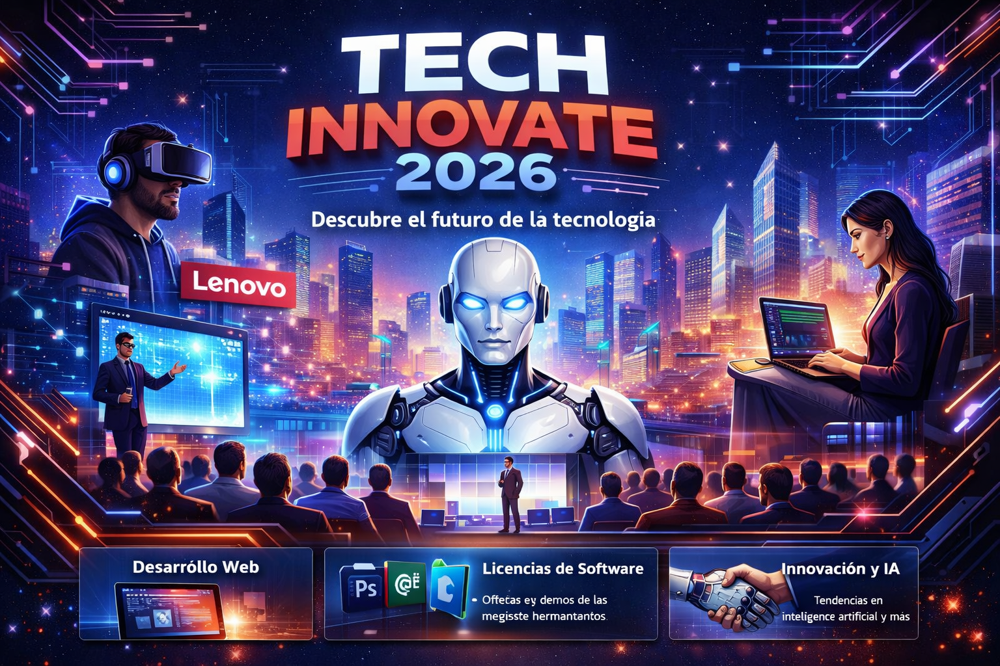

# 🚀 Tech Innovate 2026

Plataforma web para la **gestión y promoción de eventos de tecnología**, donde empresas y profesionales pueden presentar innovaciones en:

- 💻 Desarrollo Web
- 🧠 Inteligencia Artificial
- 🔐 Licencias de Software
- 🖥️ Hardware y soluciones empresariales (Lenovo, servidores, etc.)

Este proyecto está construido con **Next.js** y está diseñado para servir como **landing page moderna para eventos tecnológicos**.

---

# ✨ Características

- ⚡ Landing page rápida y optimizada
- 🎨 Diseño moderno enfocado en tecnología
- 📱 Responsive (adaptable a móvil y desktop)
- 🚀 Renderizado optimizado con Next.js
- 🧩 Arquitectura escalable

---

    # 🛠️ Tecnologías utilizadas

- **Next.js**
- **React**
- **TypeScript**
- **CSS / Tailwind (opcional si lo agregas)**
- **Vercel Deployment**

---

# 📦 Instalación

Clona el repositorio:

```bash

git clone https://github.com/Johann01H/technology-event-Don-ignacio.git